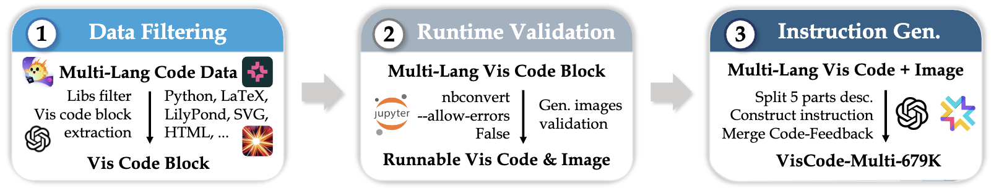
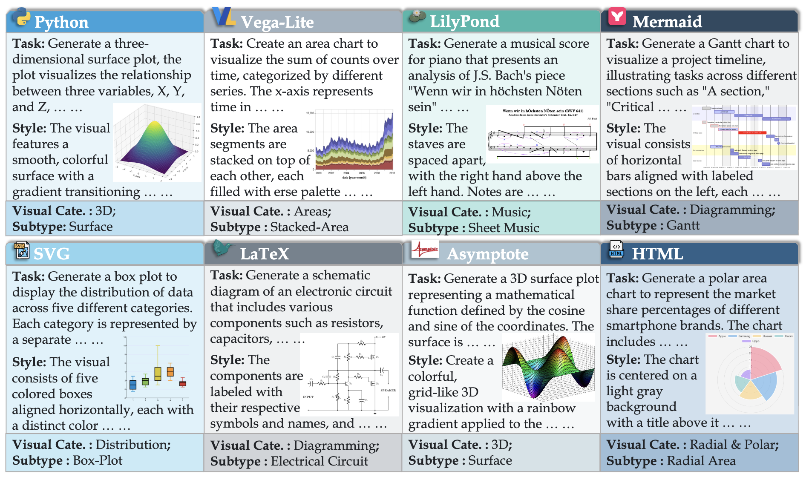
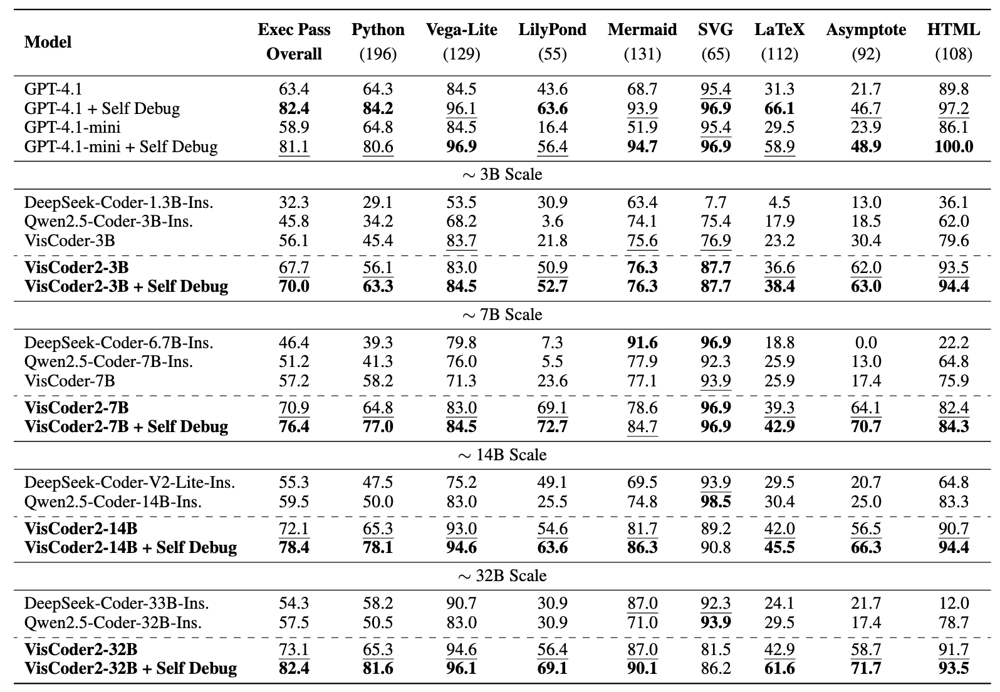

# VisCoder2: Building Multi-Language Visualization Coding Agents

[**🌐 Project Page**](https://tiger-ai-lab.github.io/VisCoder2) | [**📖 arXiv**](https://arxiv.org/abs/2510.23642) | [**🤗 VisCode-Multi-679K**](https://huggingface.co/datasets/TIGER-Lab/VisCode-Multi-679K) | [**🤗 VisPlotBench**](https://huggingface.co/datasets/TIGER-Lab/VisPlotBench) | [**🤗 VisCoder2**](https://hf.co/collections/TIGER-Lab/viscoder2)

---

## 🔔 News

- **🔥 [2025-10-25] VisCode-Multi-679K, VisPlotBench and VisCode2 models are now publicly released! Check out our [paper](https://arxiv.org/abs/2510.23642) and [Huggingface collections](https://hf.co/collections/TIGER-Lab/viscoder2).**


## 🧠 Introduction

**VisCoder2** is an open-source family of multi-language visualization coding agents capable of iteratively generating, executing, rendering, and self-debugging visualization code.

This work addresses core challenges where existing models fail:  
- Limited language coverage  
- Unreliable code execution  
- Lack of iterative correction mechanisms  

Unlike general code generation, visualization requires grounding across natural language, code, and rendered visual outputs.

To enable this, we introduce three complementary resources:

1. **VisCode-Multi-679K**:  
   A large-scale supervised dataset with **679K executable visualization samples** and **multi-turn correction dialogues** across **12 programming languages**, including Python, Vega-Lite, LaTeX, Mermaid, LilyPond, and more.

2. **VisPlotBench**:  
   A new benchmark spanning **8 languages** and **13 visual categories**, designed to systematically evaluate both **initial code generation** and **multi-round self-debug** capabilities.

3. **VisCoder2**:  
   The family of **multi-language visualization models** trained on VisCode-Multi-679K.
---

## 📊 Main Results on VisPlotBench
We evaluate **VisCoder2** on **VisPlotBench**, our new benchmark for executable visualization code generation across **8 diverse languages**.  
The primary metric is **Execution Pass Rate**, which measures whether the code runs without error and produces a valid visual.


With **iterative self-debug**, **VisCoder2-32B** achieves an **82.4% overall execution pass rate**, matching the performance of **GPT-4.1** and significantly outperforming all open-source baselines.

---

## 🛠️ Training & Evaluation
We provide both the **training dataset** and **evaluation benchmark** for VisCoder2.

- **📦 Training** is performed using the ms-swift framework with full-parameter supervised fine-tuning on our new **VisCode-Multi-679K** dataset.  
- **📊 Evaluation** is based on **VisPlotBench**, using a standardized execute–render–score pipeline that assesses models across 8 languages.  
  This includes a **self-debug evaluation mode** that allows models to revise failed generations over multiple rounds.

See the following folders for details:

- `train/` : Training scripts and configurations based on **ms-swift**  
- `VisPlotBench/` : Evaluation framework for **VisPlotBench**

---

## 📬 Contact
- **Yuansheng Ni**: yuansheng.ni@uwaterloo.ca  
- **Wenhu Chen**: wenhuchen@uwaterloo.ca  

---

## 📖 Citation

**BibTeX:**

```bibtex
@misc{ni2025viscoder2buildingmultilanguagevisualization,
      title={VisCoder2: Building Multi-Language Visualization Coding Agents}, 
      author={Yuansheng Ni and Songcheng Cai and Xiangchao Chen and Jiarong Liang and Zhiheng Lyu and Jiaqi Deng and Kai Zou and Ping Nie and Fei Yuan and Xiang Yue and Wenhu Chen},
      year={2025},
      eprint={2510.23642},
      archivePrefix={arXiv},
      primaryClass={cs.SE},
      url={https://arxiv.org/abs/2510.23642}, 
}

@article{ni2025viscoder,
  title={VisCoder: Fine-Tuning LLMs for Executable Python Visualization Code Generation},
  author={Ni, Yuansheng and Nie, Ping and Zou, Kai and Yue, Xiang and Chen, Wenhu},
  journal={arXiv preprint arXiv:2506.03930},
  year={2025}
}